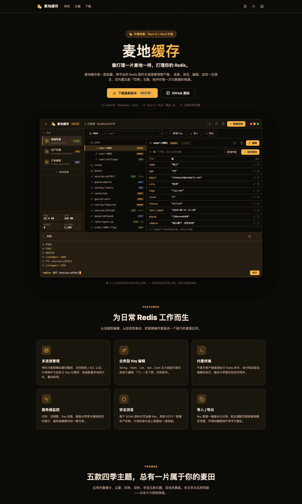
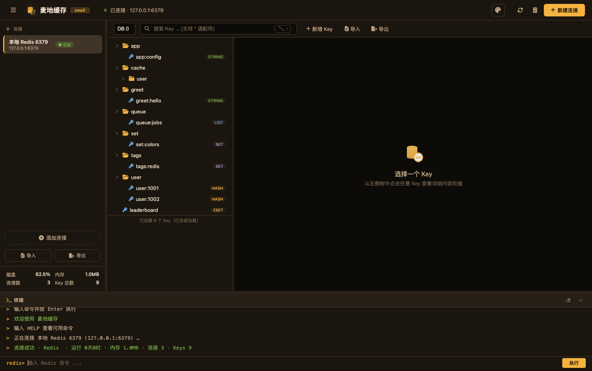
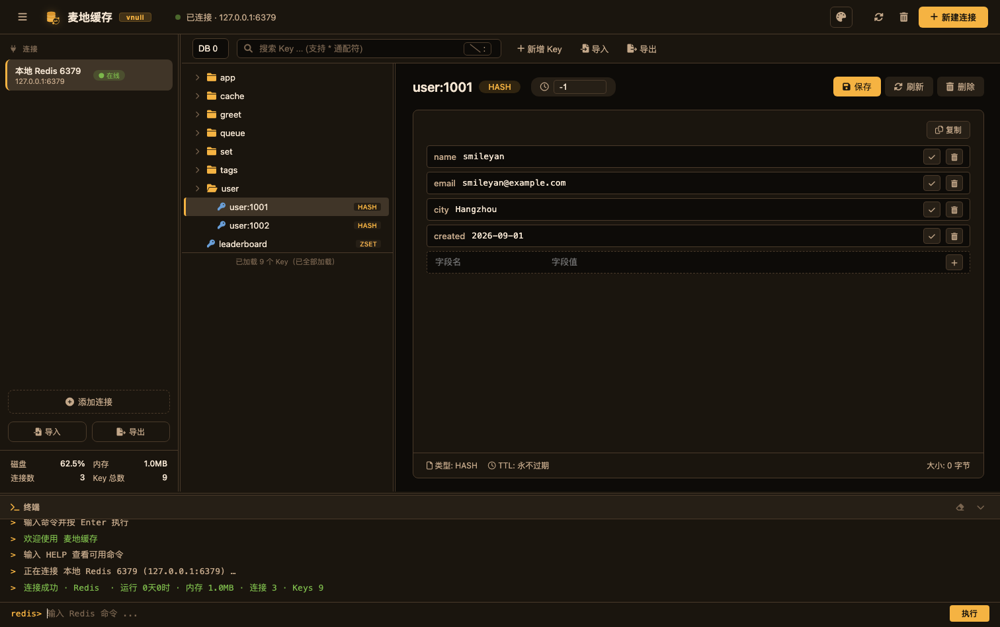
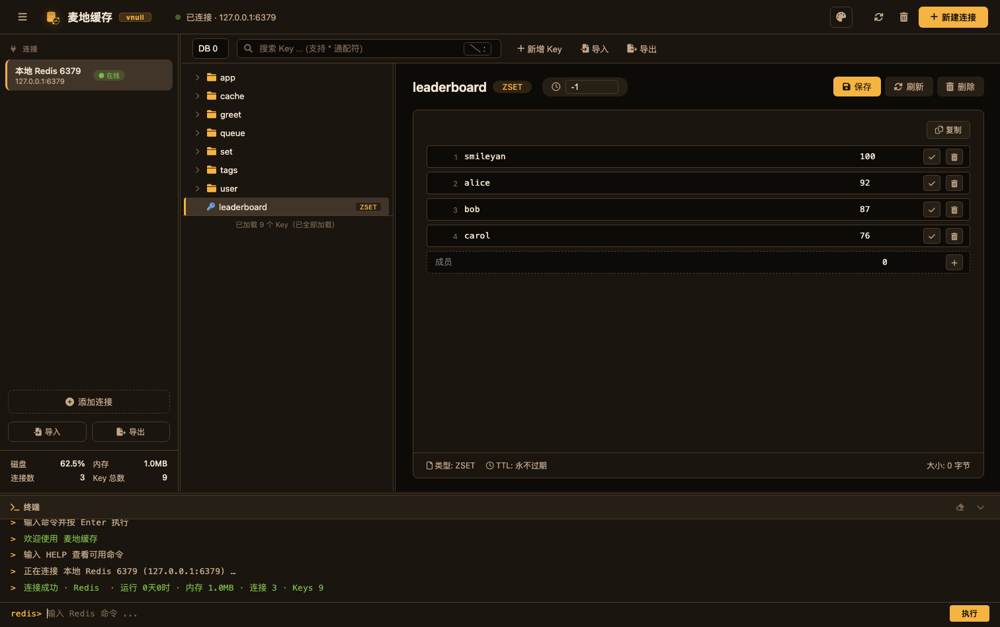
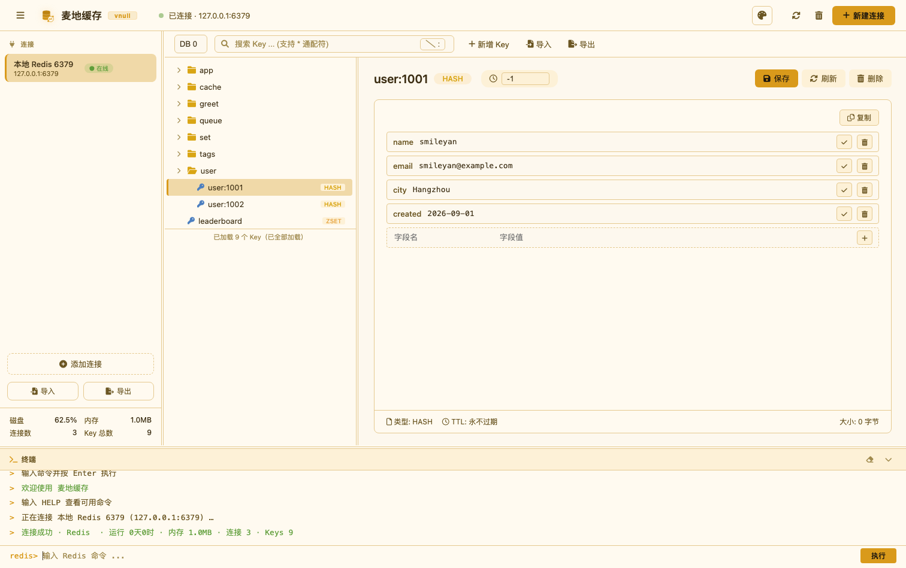

# 麦地缓存（MyRedis）

开源、轻量、跨平台的 **Redis 图形化桌面管理客户端**。
连接、浏览、编辑、监控 Redis，一应俱全；内置春分、立夏、初秋、深秋、冬至五款四季主题。

基于 **Tauri 2 + Rust** 构建，支持 macOS / Windows / Linux 三大平台。

> ## 🌾 官网：**[https://myredis.cn](https://myredis.cn)**
>
> 下载安装包、使用文档、更新日志，请访问 **官网 [myredis.cn](https://myredis.cn)**。
> GitHub 仓库仅托管源码与 Release 附件，**一切产品信息以官网 myredis.cn 为准**。

[](https://myredis.cn)
[](https://github.com/myredisapp/myredis/releases)

---

## 界面预览

### 官网 myredis.cn

[](https://myredis.cn)

> 上图即官网 **[myredis.cn](https://myredis.cn)** 首页 —— 下载、文档、功能介绍都在那里。

### 桌面客户端（深秋 · 暗色金）







### 桌面客户端（初秋 · 亮金色）



---

## 功能特性

- **多连接管理**：单机 / 集群连接，配置本地持久化，支持测试连接、只读模式、自定义 Key 分隔符、连接配置导入导出
- **全类型 Key 编辑**：String / Hash / List / Set / ZSet 内容加载与字段级编辑，TTL 修改，批量删除
- **大数据量友好**：`SCAN` 游标分页 + 虚拟滚动，几十万 Key 不卡；搜索下推后端 `SCAN MATCH`
- **内置终端**：真实命令转发，redis-cli 风格输出，只读连接自动拦截写命令
- **服务器监控**：Key 总数 / 内存 / 连接数 / 磁盘使用率实时刷新
- **导入 / 导出**：Key 与连接配置均可导出为 JSON 并再导入，支持覆盖 / 跳过冲突策略
- **自动更新**：后台静默下载，验签后重启生效
- **五款四季主题**：春分、立夏、初秋、深秋、冬至

## 下载安装

前往 **[官网 myredis.cn](https://myredis.cn)** 直接下载对应平台的安装包：

| 平台 | 安装包 |
|------|--------|
| macOS | `myredis-<版本>-macos-universal.dmg`（Apple Silicon / Intel 通用） |
| Windows | `myredis-<版本>-windows-x64.exe`（NSIS）/ `.msi` |
| Linux | `myredis-<版本>-linux-x64.deb` / `.AppImage` |

安装包由 GitHub Actions 基于 tag 自动构建并发布到 [GitHub Releases](https://github.com/myredisapp/myredis/releases)；
**下载入口与安装指引以官网 [myredis.cn](https://myredis.cn) 为准**。

> ⚠️ macOS 首次打开如被 Gatekeeper 拦截，请右键 →「打开」。应用未做 Apple 代码签名 / 公证，
> 自动更新由 Tauri 自己完成并只认 minisign 验签，不依赖 Apple 签名。

## 使用文档

用户文档（功能现状、快捷键、FAQ）见：

- **在线版：[myredis.cn/docs](https://myredis.cn/docs)**（随 Release 一起发布）
- 仓库源码：[`web/docs/index.html`](web/docs/index.html)

## 本地开发

要求：Rust toolchain + Tauri 2 环境（见 [Tauri 前置依赖](https://v2.tauri.app/start/prerequisites/)）。前端为单文件原生 HTML/JS，无构建步骤。

```bash
cd src-tauri

# 运行（开发，改 frontend/index.html 热重载）
cargo tauri dev

# 单元测试（不依赖 Redis）
cargo test

# 代码检查（提交前强制）
cargo clippy -- -D warnings
cargo fmt --check
```

打包发布、CI、自动更新签名等工程约定，见 [DEVELOPMENT.md](DEVELOPMENT.md)。

## 项目文档

| 文档 | 说明 |
|------|------|
| [DEVELOPMENT.md](DEVELOPMENT.md) | 开发进度、待办事项、代码规范、打包发布踩坑记录 |
| [PROJECT_PLAN.md](PROJECT_PLAN.md) | 立项方案书（v0.1 草案，历史参考） |
| [web/index.html](web/index.html) | 官网首页源码（部署在 **myredis.cn**） |
| [web/docs/index.html](web/docs/index.html) | 官网使用文档源码 |

## 技术栈

Tauri 2 · Rust 2021 · [`redis` 0.25](https://crates.io/crates/redis)（tokio-comp / cluster-async）· tokio · 单文件原生 JS 前端
